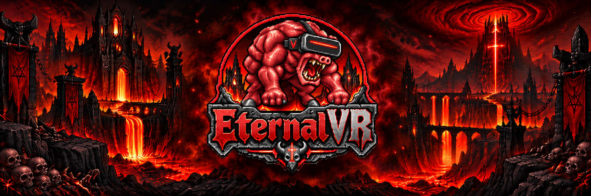

# EternalVR

> **Alpha.** Playable, rough in places, and changing fast. Read the known issues before you play.

**Hell in your headset.** A free VR mod for DOOM Eternal on PC (Steam), through OpenXR.

## Features

- True stereo, with 6DoF head tracking, seated or standing.
- Motion controllers with hand aiming: the gun goes where your hand points.
- Punch for real to melee, glory kill a staggered demon or Blood Punch.
- Room-scale: walk around your room and the Slayer walks with you.
- The weapon wheel on the right stick, and every tutorial and popup action on a button.
- The HUD and menus on panels in VR, with a laser pointer; cutscenes on a big screen.
- A desktop window mirroring the game for people watching.
- The full campaign and both DLC (single-player only).
- A launcher that checks your game version, sets everything up for the session and restores your
  settings afterwards.

## Planned

No dates yet:

- Full rigging for each arm: both arms follow your hands, with a free off hand and left-handed play.
- More VR interactions with the world, beyond punching.
- The HUD on your wrist or weapon instead of a floating panel.
- Optimizations, especially on the processor side, for more frames on more PCs.
- Improved DLSS, and anti-aliasing that is sharp in both eyes.
- Remapping the controls in the launcher.
- Controller vibration.
- More ways to use the weapon wheel (pointing or motion).
- Bindings for more controllers (Windows Mixed Reality, Vive, Pico and others).

## Headsets, and we need testers

It should work with any PC VR headset that has an OpenXR runtime: Virtual Desktop, Meta Horizon Link,
SteamVR and others. So far it has been tested on a Quest 3 through Virtual Desktop, with an RTX 4080 and
an RTX 3080 Ti. Quest (Touch) and Valve Index controllers have bindings; other controllers need theirs
added.

If you try it on anything else (another headset or runtime, an AMD or Intel graphics card), please
tell us how it went, good or bad, in an [issue](../../issues/new/choose) or in
[Discussions](../../discussions). Bug reports, ideas and pull requests are all welcome.

See [`docs/release/KNOWN-ISSUES.md`](docs/release/KNOWN-ISSUES.md) for what does not work yet, and
[`docs/ROADMAP.md`](docs/ROADMAP.md) for the plan.

This is an unofficial fan project. It is not affiliated with or endorsed by id Software, Bethesda or
ZeniMax. DOOM is a trademark of id Software / ZeniMax Media Inc. You need a legal copy of DOOM Eternal.
No game assets are distributed.
The code is MIT-licensed (`LICENSE`); the EternalVR name and logo are not (`branding/README.md`).

## Requirements

- Windows 10 or 11.
- DOOM Eternal on Steam, at the supported build (Steam build 25216728; the launcher shows whether yours
  is supported).
- A PC VR headset with an OpenXR runtime (see above for what has been tested).

## Download and install

Download the latest zip from [GitHub Releases](../../releases) and follow
[`docs/release/INSTALL.md`](docs/release/INSTALL.md). Nothing is installed into Windows or into the game
folder. [`docs/release/TROUBLESHOOTING.md`](docs/release/TROUBLESHOOTING.md) explains the launcher's
messages.

## Controls

Every button is listed in [`docs/release/CONTROLS.md`](docs/release/CONTROLS.md). To change them, edit a
text file: see
["Changing the controls"](docs/release/CONTROLS.md#changing-the-controls) there. A remapping screen in
the launcher is planned.

## Reporting bugs

Open a [GitHub issue](../../issues/new/choose) with the bug template. In the launcher, click
**Export report...** and attach the zip: it holds the launcher and mod logs with your user name and Steam
account ID removed, and the dialog lists every file before you save it. Check
[`docs/release/KNOWN-ISSUES.md`](docs/release/KNOWN-ISSUES.md) first.

## Ideas and questions

Use [GitHub Discussions](../../discussions) for ideas, questions and setups that work (or do not).

## Support

EternalVR is free and stays free. If you want to support it:
[ko-fi.com/FanciestPeanut](https://ko-fi.com/FanciestPeanut).

## Layout
- `docs/SCOPE.md`: what we are building, requirements, in and out of scope
- `docs/DECISIONS.md`: decision log
- `docs/ARCHITECTURE.md`: design baseline
- `docs/ROADMAP.md`: milestones with done-when criteria
- `docs/PLAN_M1_M3.md`, `docs/RIG_BRINGUP.md`: task plan for the next milestones and the rig runbook
- `docs/research/`: research notes behind the design; `docs/notes/`: short fact sheets they rely on
- `reference/MANIFEST.md`: index of the third-party documentation the research used (not redistributed;
  `tools/fetch_references.sh` fetches the public sources into `reference/`)
- `src/`, `tests/`, `tools/`, `launcher/`: the layer, its tests, rig tools and the launcher (see `CONTRIBUTING.md` to build and test)
- `docs/release/`: the alpha's install, controls, known issues and troubleshooting
- `branding/`: the logo and the launcher icon
- `THIRD_PARTY_NOTICES.md`: origins and licences of third-party code

## Acknowledgements
Thanks to the wider Flat2VR community. Any code adapted from other projects is listed in
`THIRD_PARTY_NOTICES.md`.

Thanks to [KHARVOX](https://github.com/CactusVRStudios/KHARVOX), a DOOM 2016 VR mod, whose ideas informed some of EternalVR's design.
